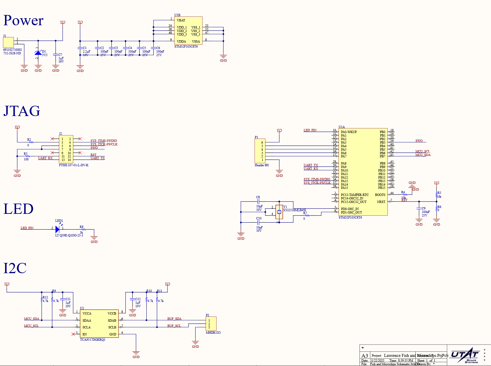
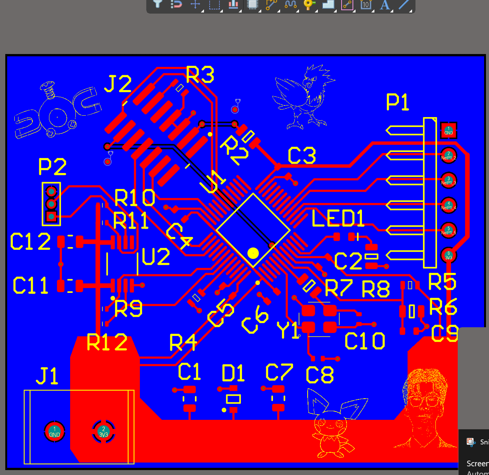
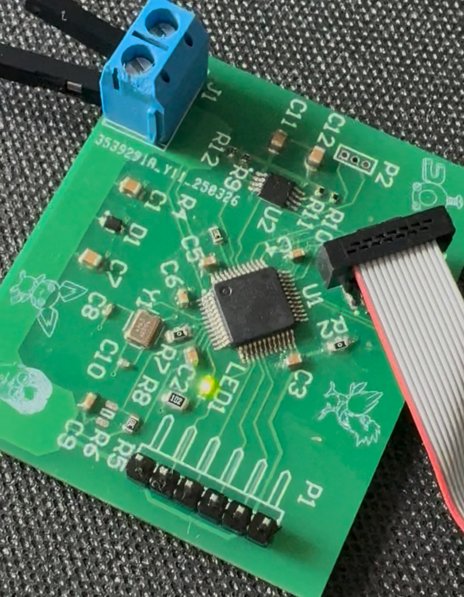

# Onboard-Computer PCB Project

## Overview
A simple onboard-computer using the STM32F103C8T6 microcontroller, programmed through JTAG, and includes I2C and other peripherals. Made through Altium and ordered through JLCPCB

## Key Images

### Schematic Overview

### PCB Layout

### Soldered PCB

### LED Blink Test

### I2C Testing

