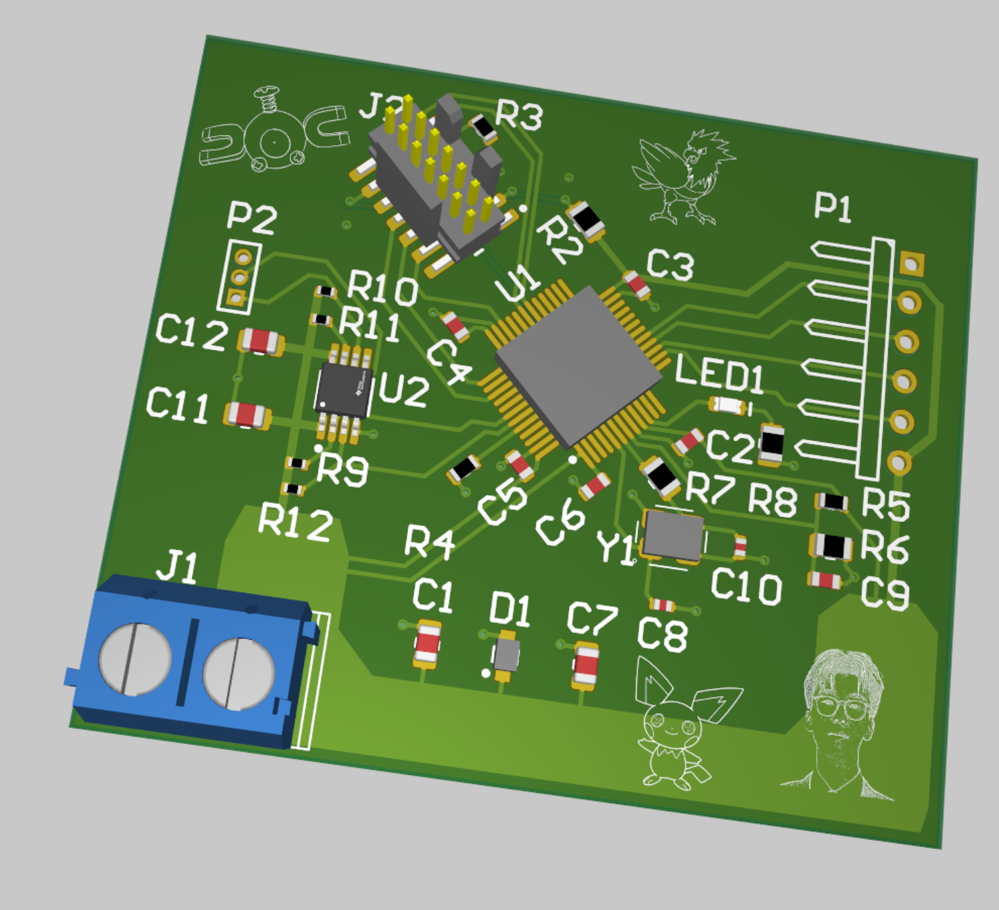
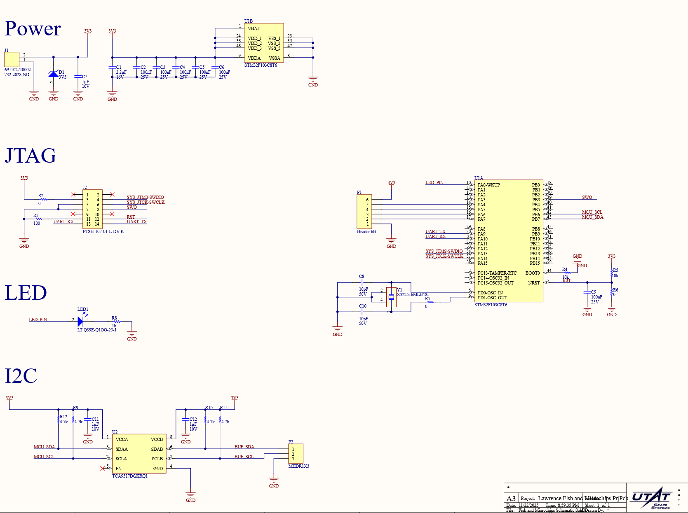
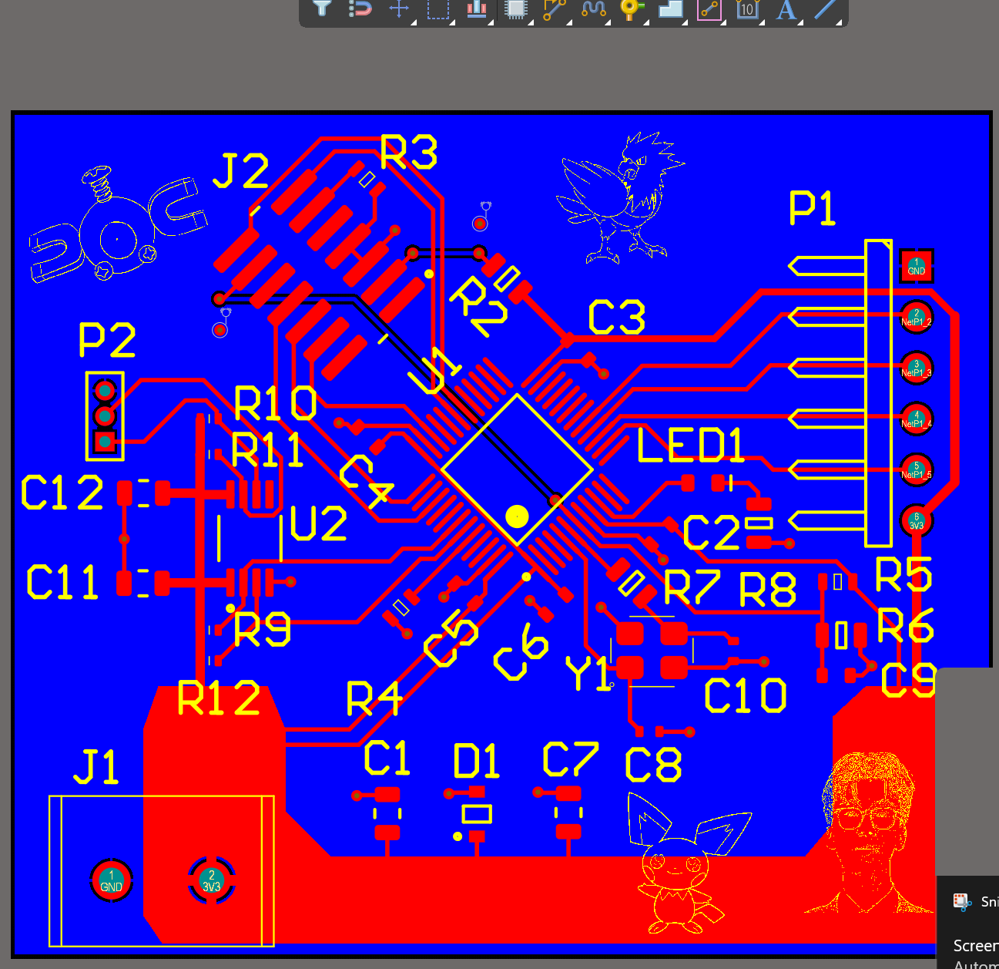
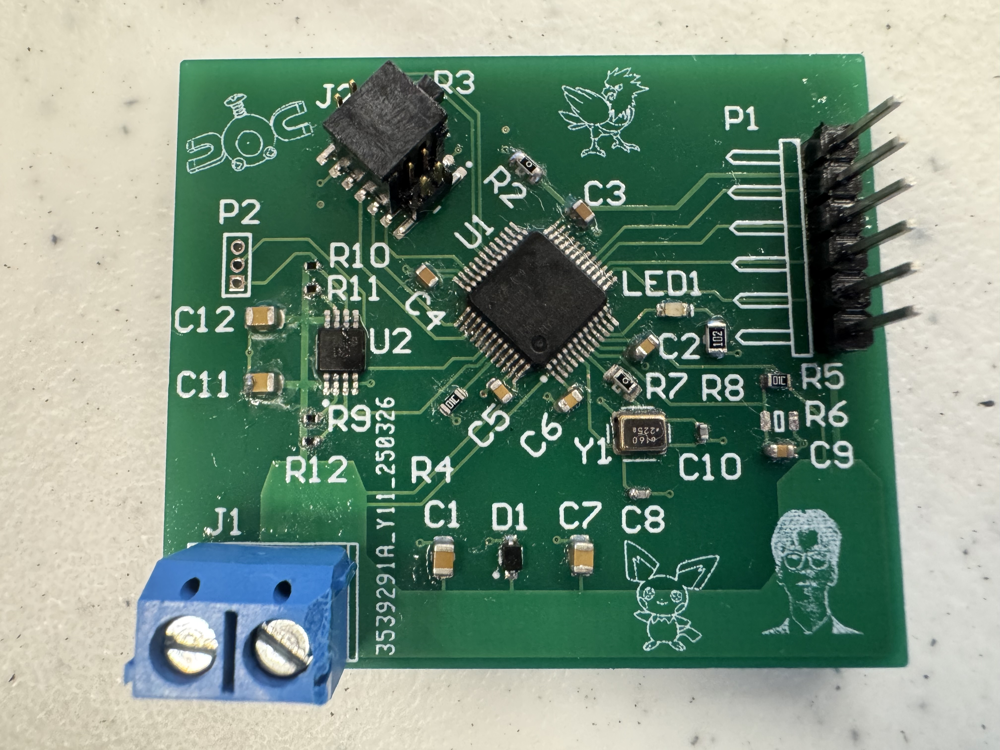
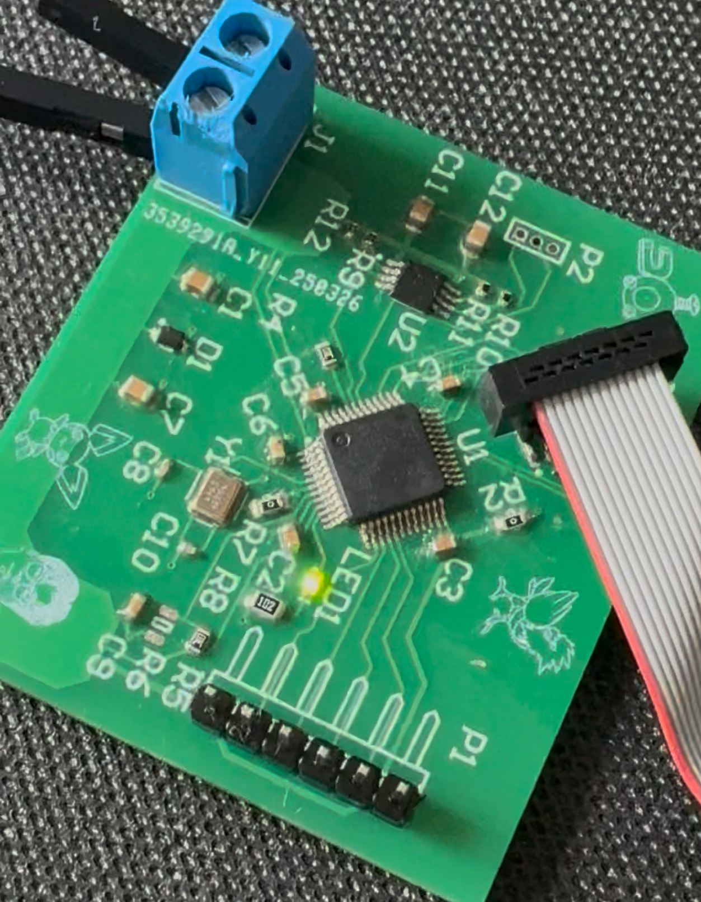
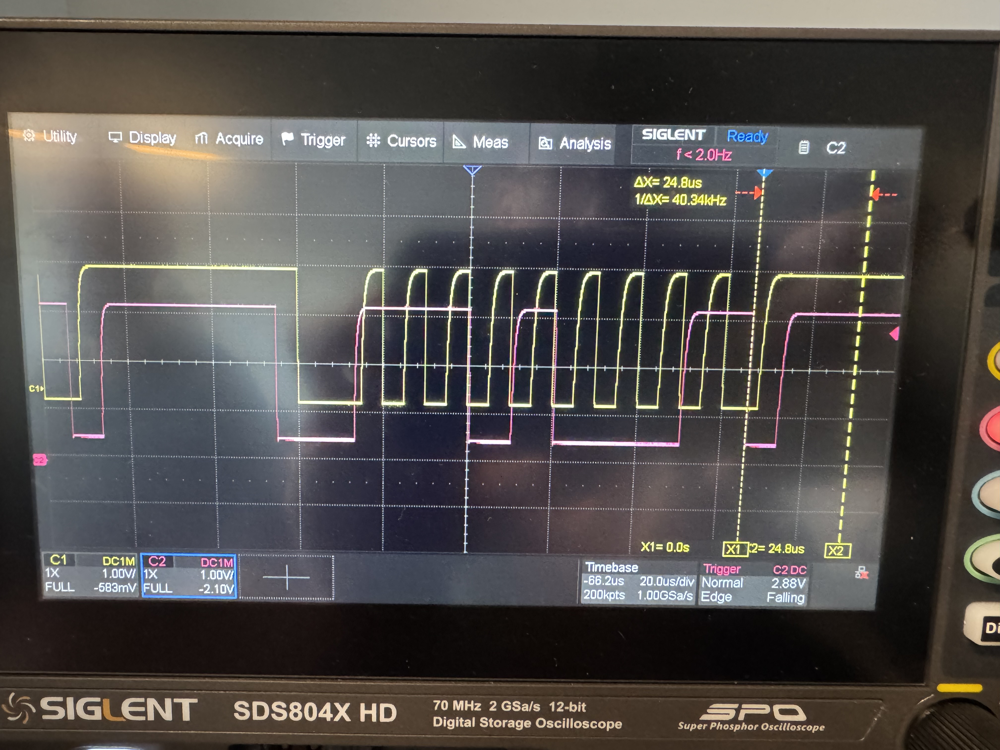

# Onboard-Computer PCB Project

Links:

**[Schematic + layout PDF](FAB-Lawrence%20Fish%20and%20Microchips-A.1/Lawrence%20Fish%20and%20Microchips_Prints.PDF)**

**[BOM](FAB-Lawrence%20Fish%20and%20Microchips-A.1/BOM/Bill%20of%20Materials-Lawrence%20Fish%20and%20Microchips.xlsx)**

**[Fab package](FAB-Lawrence%20Fish%20and%20Microchips-A.1/)**

## Overview
A simple onboard-computer using the STM32F103C8T6 microcontroller, programmed through JTAG, and includes I2C and other peripherals. 2-layer board with 32 components. Made through Altium and ordered through JLCPCB

## Key Images

### Schematic Overview

### PCB Layout

### Soldered PCB

### LED Blink Test
To confirm the board is working, we programmed the microcontroller to blink its LED.

### I2C Testing
We also tested the board's I2C capability. 

